# Creating DevOps Challenge VPC

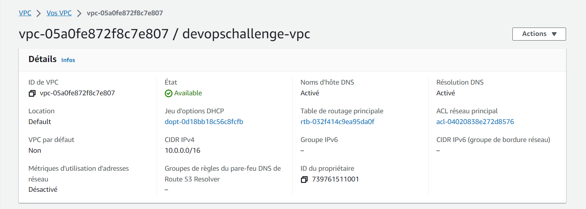

## Creation of RDS PostgreSQL Instance Inside the New VPC
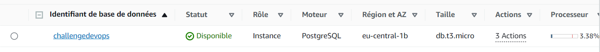

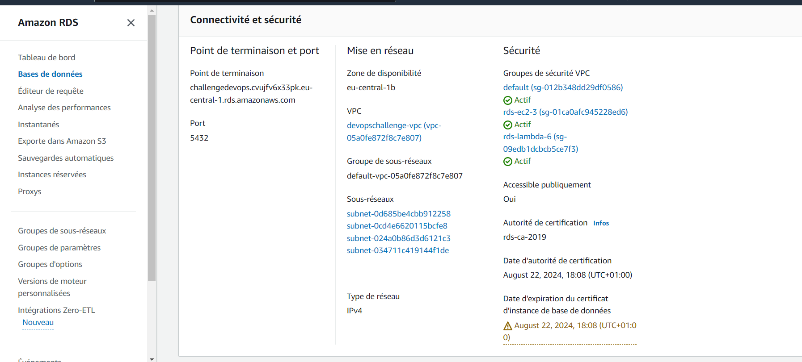

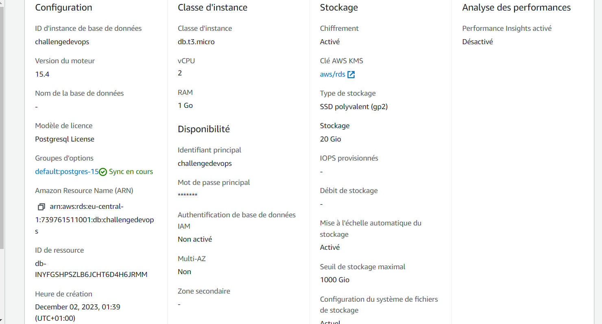

## Link the RDS PostgreSQL to EC2 and Create a New Table
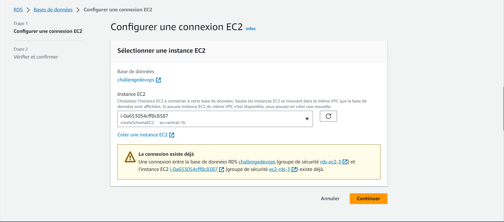
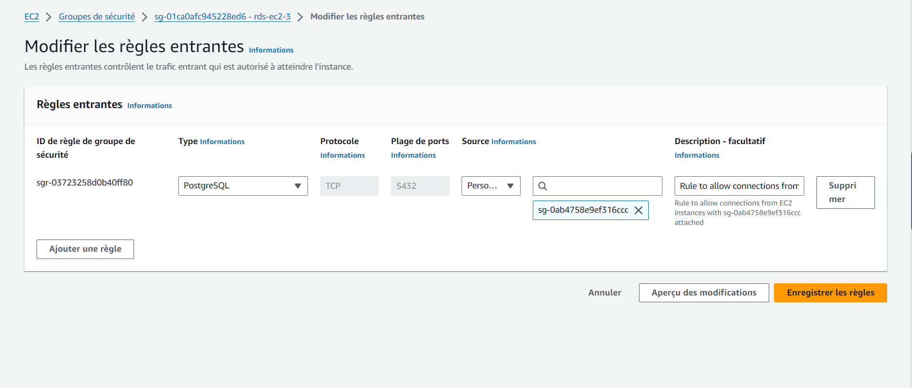
Note: This rule has been automatically generated to permit connections from the EC2 instance.

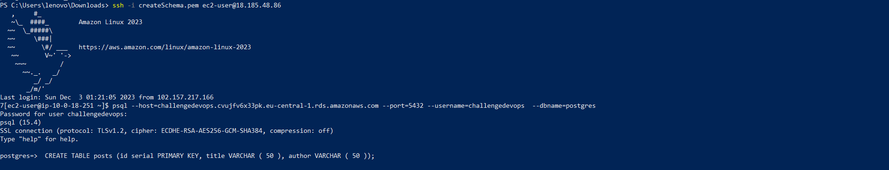
Create a table `posts` with two columns `title` and `author`.

## Create an AppSync API Named ChallengeDevOps

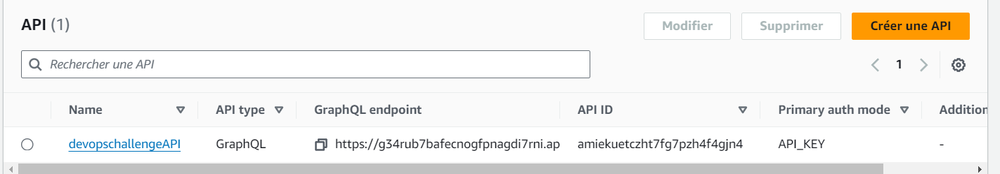
The schema is:
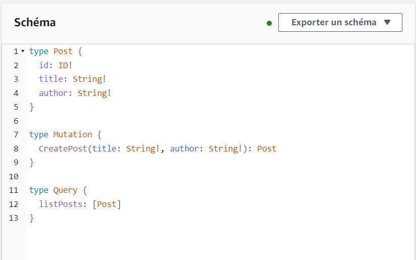

## Create a Lambda Function as a Data Source for ChallengeDevOps API in the Same VPC
### Configure Environment Variables
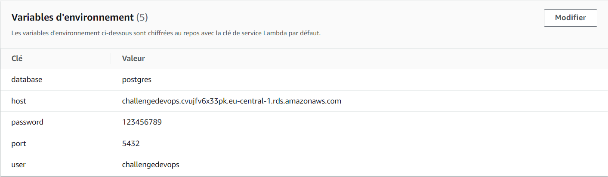
### Configure Connection Between RDS and Lambda Function
And then set change `rds.force_ssl` value to `0` so that the Lambda function can access the database because by default, our RDS database can only be accessible from SSH.
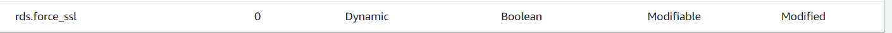
### Configure Proxy Connection
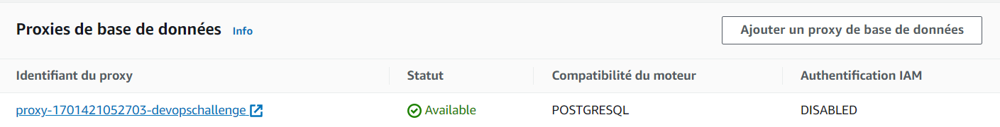
### Configure Security Group so that the Lambda function can access the RDS database
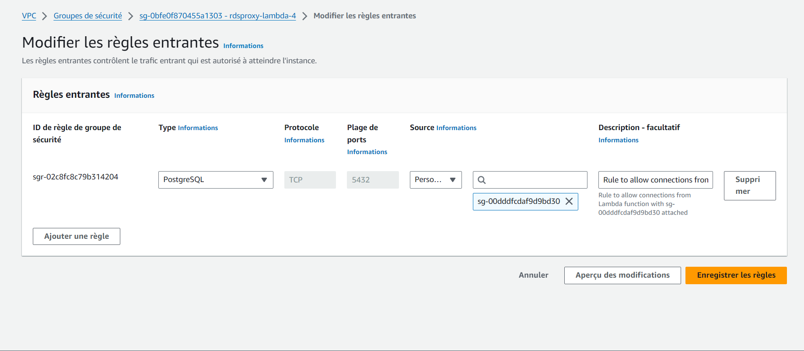

### Write the Logic of the Function Locally, Then Deploy It as a .zip File
You can see the entire code in this repo in a file named `Lambda-function-logic.js`.
### Create the Data Source for AWS AppSync
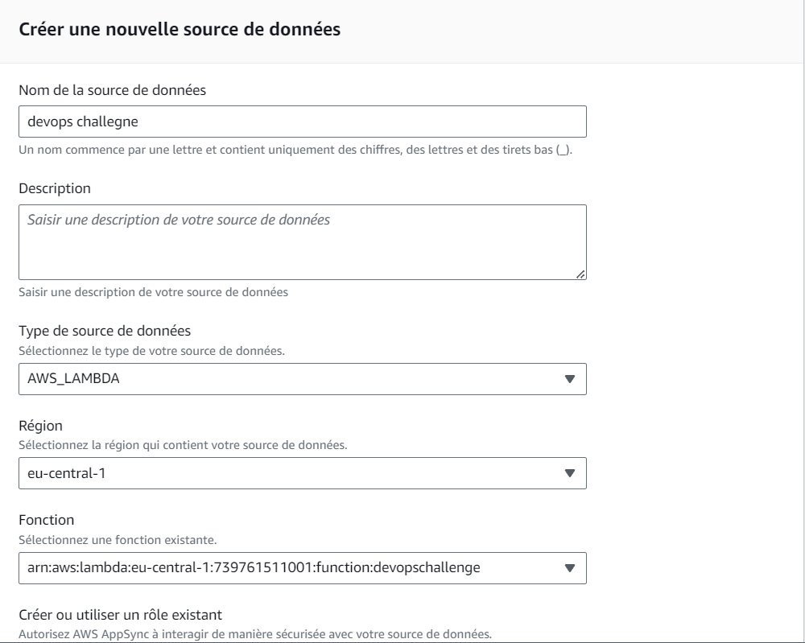
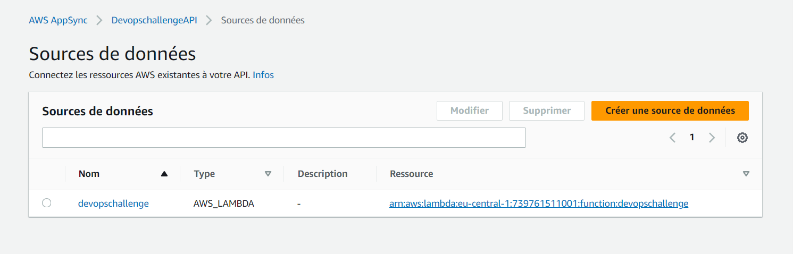

## Attach Resolver for the Query and Mutation
### For the CreatePost Mutation
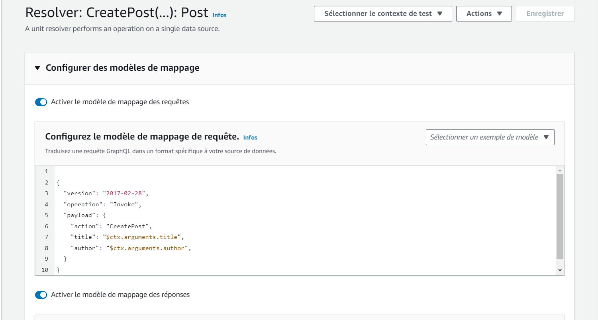
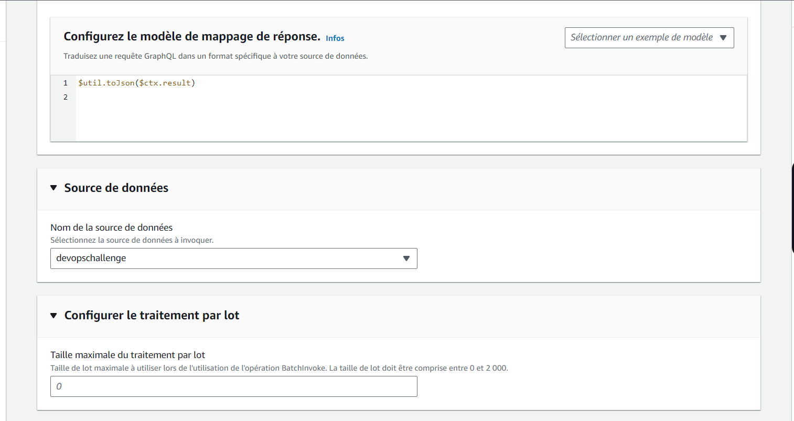
Note: This is the test of the mutation
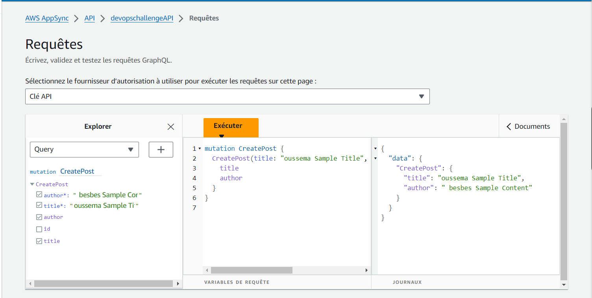

### For the ListPosts Query
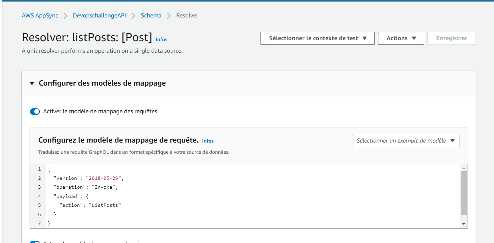
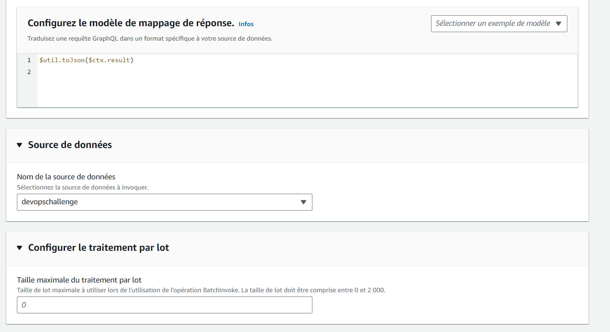
Note: This is the test of the query
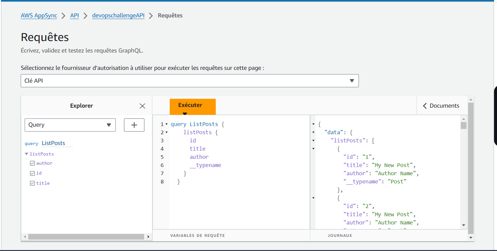

## Integrate These APIs with Amplify and React
I followed those instructions.
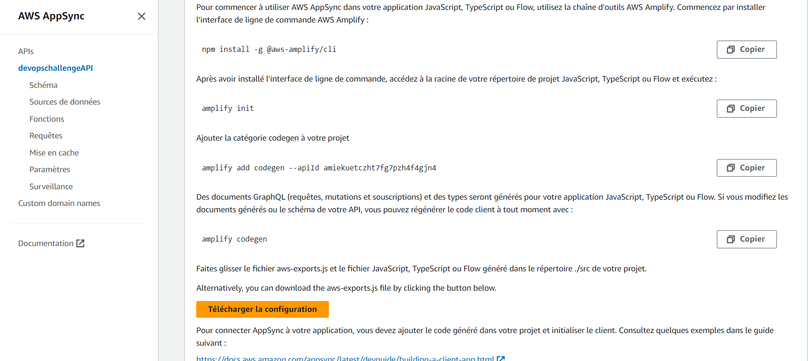
And I had to create an access key.
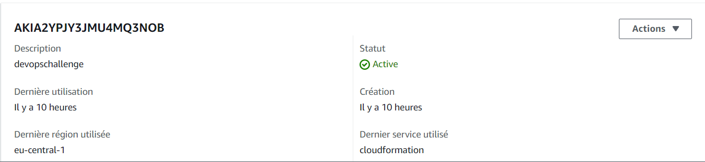
I used it in `amplify init`, then I wrote the entire logic based on Amplify documentation [https://docs.amplify.aws/react/](https://docs.amplify.aws/react/).

## Set Up GitHub Actions for My React-Amplify Application
Step 1: Create a Workflow File
Step 2: Add a New Workflow
Step 3: Define the Workflow in the YAML File
Step 4: Push the Changes
Name of the file: `ci-cd.yml`

## Making Changes to This Last API from Local and Deploy It from the CI/CD GitHub Actions after making changes
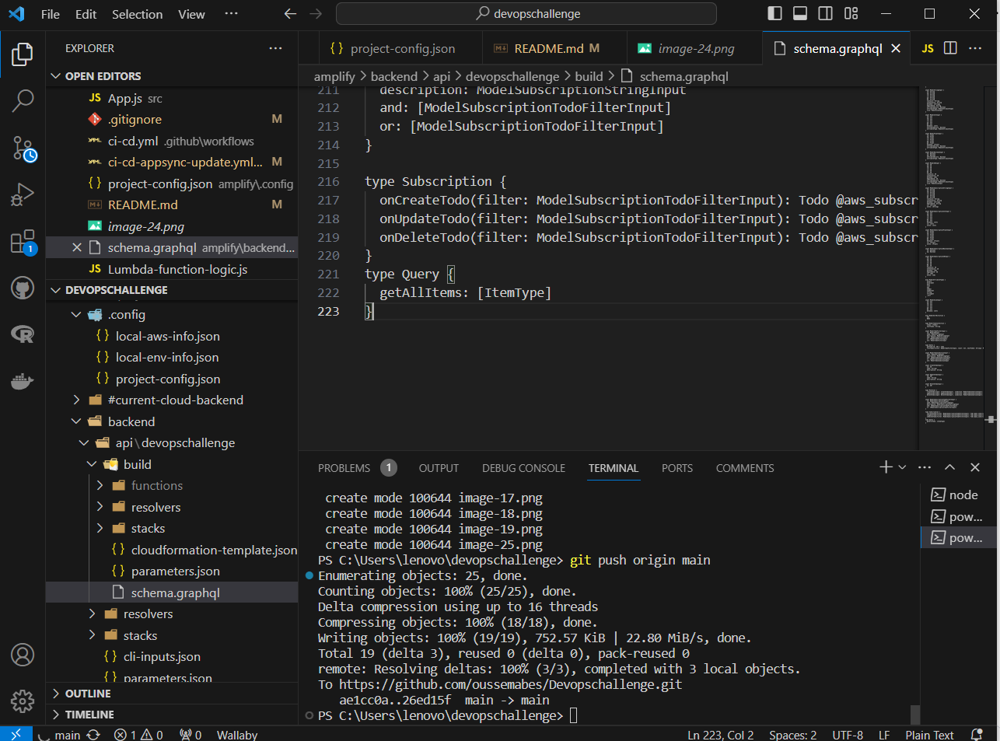
## Add Secret Access Key for best practices
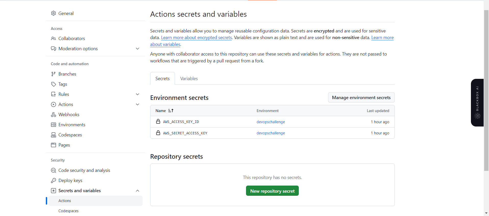
Name of the file CI/CD configuration: `ci-cd-appsync-update.yml`

