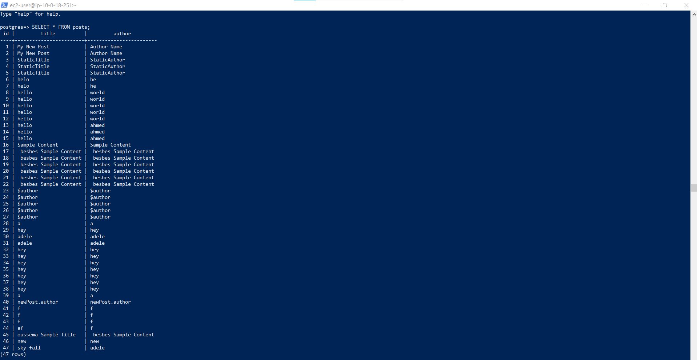

# Creating devopschallenge VPC

## Creation of RDS postgres instance inside the new VPC

## Link the RDS postgres to EC2 and create new table

Note:This rule has been automatically generated to permit connections from the EC2 instance.

Create table `posts` with two colums `title` and `author`

## Create an AppSync API named challengedevops

the schema is

## Create an Lumbda function as Data source for challengedevops API in the same VPC
### Configure environment variables

### Configure connection between RDS and Lumbda function
and then set change `rds.force_ssl` value to `0` so that lumbda function can acces the data base because by default our RDS data base can only be accesible from ssh

### Configure poxy connection

### configure security Group so that lumbda function can acces the RDS database

### Write the logic of the function in the local then deployed it as .zip file
you can see the entrie code in this repo in file named `Lumbda-function-logic.js`
### Create the data source for AWS Appsync

## Attach resolver for the query and mutation
### for the CreatePost mutation

Note:this is the test of mutation

### for the Listposts query

Note:this is the test of query

## Integrate this API's with amplify and react
i followed those instrunctions

and i had to create an access key

i used it in amplify init then i write the entire logic based on amplify documentation `https://docs.amplify.aws/react/`

## Set Up GitHub Actions for my react-amplify Application
step 1 : Create a Workflow File
step 2 : Add a New Workflow
step 3 : Define the Workflow in the YML File
step 4 : Push the Changes

## Addinitinal work : add create Api appsync Graphql from local and push it to aws

## Making changes to this last api from local and deploy it from the ci/cd github actions
See the section about [deployment](https://facebook.github.io/create-react-app/docs/deployment) for more information.

### `npm run eject`

**Note: this is a one-way operation. Once you `eject`, you can't go back!**

If you aren't satisfied with the build tool and configuration choices, you can `eject` at any time. This command will remove the single build dependency from your project.

Instead, it will copy all the configuration files and the transitive dependencies (webpack, Babel, ESLint, etc) right into your project so you have full control over them. All of the commands except `eject` will still work, but they will point to the copied scripts so you can tweak them. At this point you're on your own.

You don't have to ever use `eject`. The curated feature set is suitable for small and middle deployments, and you shouldn't feel obligated to use this feature. However we understand that this tool wouldn't be useful if you couldn't customize it when you are ready for it.

## Learn More

You can learn more in the [Create React App documentation](https://facebook.github.io/create-react-app/docs/getting-started).

To learn React, check out the [React documentation](https://reactjs.org/).

### Code Splitting

This section has moved here: [https://facebook.github.io/create-react-app/docs/code-splitting](https://facebook.github.io/create-react-app/docs/code-splitting)

### Analyzing the Bundle Size

This section has moved here: [https://facebook.github.io/create-react-app/docs/analyzing-the-bundle-size](https://facebook.github.io/create-react-app/docs/analyzing-the-bundle-size)

### Making a Progressive Web App

This section has moved here: [https://facebook.github.io/create-react-app/docs/making-a-progressive-web-app](https://facebook.github.io/create-react-app/docs/making-a-progressive-web-app)

### Advanced Configuration

This section has moved here: [https://facebook.github.io/create-react-app/docs/advanced-configuration](https://facebook.github.io/create-react-app/docs/advanced-configuration)

### Deployment

This section has moved here: [https://facebook.github.io/create-react-app/docs/deployment](https://facebook.github.io/create-react-app/docs/deployment)

### `npm run build` fails to minify

This section has moved here: [https://facebook.github.io/create-react-app/docs/troubleshooting#npm-run-build-fails-to-minify](https://facebook.github.io/create-react-app/docs/troubleshooting#npm-run-build-fails-to-minify)
